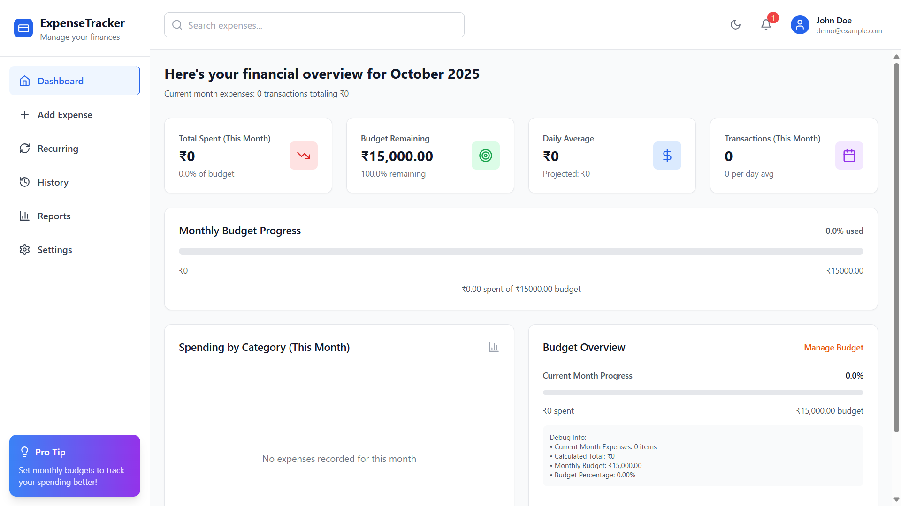
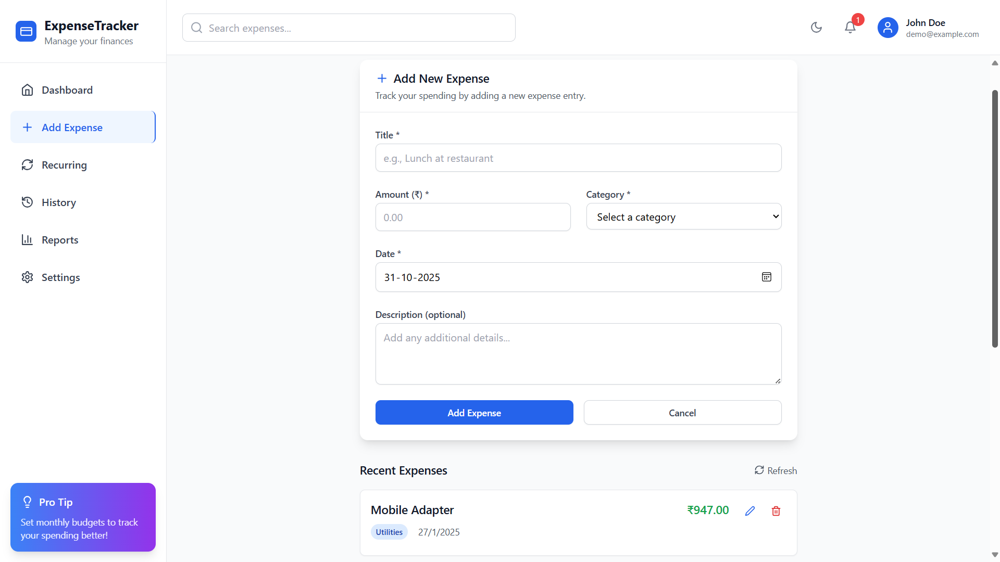
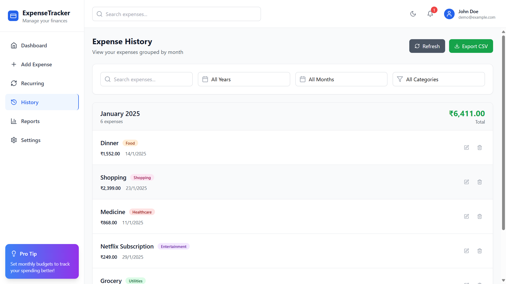
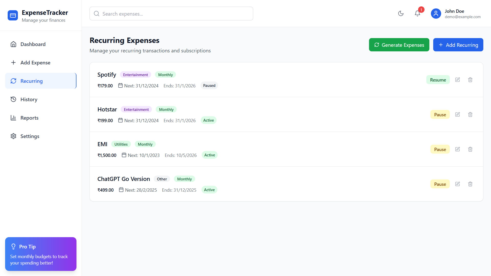
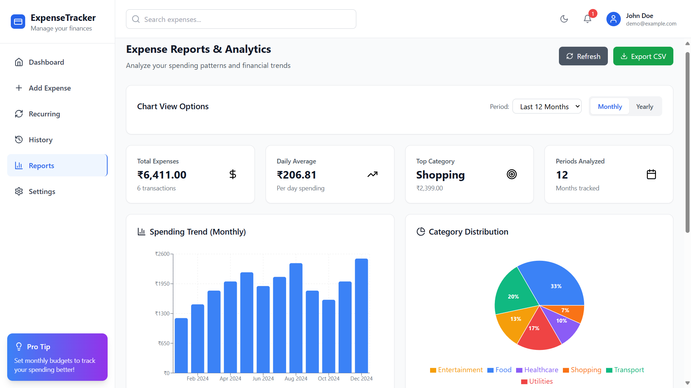

# Expense Tracker

## Expense Tracker — Smart Personal Finance Dashboard for Managing & Visualizing Expenses


### Friendly, data‑driven expense tracking with analytics, budgets, recurring payments, and rich visualizations.

---

## Table of Contents

- [Overview](#overview)
- [Key Features](#key-features)
- [Demo / Screenshots](#demo--screenshots)
- [Tech Stack](#tech-stack)
- [Architecture](#architecture)
- [Installation](#installation)
- [Usage](#usage)
- [Configuration](#configuration)
- [Roadmap](#roadmap)
- [License](#license)
- [Contact](#contact)

---

## Overview

Expense Tracker is a full‑stack web application to record, categorize, and analyze personal spending. It helps you:

- Understand where your money goes
- Track recurring expenses and subscriptions
- Visualize spending trends over time
- Export/Import data for backups or migration

With a clean UI, fast search, and actionable charts, Expense Tracker makes daily budgeting effortless.

---

## Key Features

- **Authentication with JWT**: Secure login and protected endpoints.
- **Expense CRUD**: Add, edit, delete, and search expenses.
- **Categories & Tags**: Organize spending by category and keyword.
- **Recurring Payments**: Automate periodic expenses (daily, weekly, monthly, yearly).
- **Dashboards & Analytics**: Summaries, trends, and category breakdowns.
- **Interactive Charts**: Visualize monthly and category spend.
- **Reports**: Overview and detailed history views.
- **CSV Import/Export**: Move data easily via CSV (powered by PapaParse).
- **Responsive UI**: Modern, mobile‑friendly layout with Tailwind CSS.
- **API Fallback**: If backend is unavailable, selected features gracefully fallback to local storage for demos.

---

## Demo / Screenshots

<p align="center">
  
  <br/>
  <em>Dashboard — at‑a‑glance overview of spending</em>
</p>

<p align="center">
  
  <br/>
  <em>Add Expenses — fast input with categories and notes</em>
</p>

<p align="center">
  
  <br/>
  <em>History — filterable, searchable list of all transactions</em>
</p>

<p align="center">
  
  <br/>
  <em>Recurring — manage subscriptions and periodic expenses</em>
</p>

<p align="center">
  
  <br/>
  <em>Reports — category and time‑based analytics</em>
</p>

---

## Tech Stack

- **Frontend**: React 18, TypeScript, Vite, React Router, Tailwind CSS, Recharts, React Hot Toast
- **Backend**: Django 4.2, Django REST Framework, Simple JWT, django‑cors‑headers, Pillow
- **Database**: SQLite (dev). Easily swappable to PostgreSQL/MySQL.
- **Auth**: JWT tokens via DRF SimpleJWT
- **Utilities**: Axios, date‑fns, PapaParse

---

## Architecture

```mermaid
flowchart LR
  A[React + Vite (Frontend)] -- Axios/JSON --> B[(Django REST API)]
  B -- ORM --> C[(Database: SQLite / Postgres / MySQL)]
  A --> D[Recharts Visualizations]
  A --> E[Tailwind UI]
  B --> F[JWT Auth]
```

- **Frontend** handles UI, routing, and data fetching via Axios
- **Backend** exposes RESTful endpoints (JWT‑protected)
- **Database** persists users, expenses, categories, and recurring rules
- **Visualization** uses Recharts for interactive insights

---

## Installation

> Prerequisites: Node.js 18+ (preferably 20+), Python 3.10+, Git

1. **Clone the repository**

```bash
git clone <your-repo-url>
cd Expense_Tracker
```

2. **Backend setup (Django)**

```bash
# (Windows PowerShell)
python -m venv .venv
.\.venv\Scripts\Activate.ps1
pip install -r backend/requirements.txt

# Migrate DB and create a superuser
cd backend
python manage.py migrate
python manage.py createsuperuser
```

3. **Frontend setup (React + Vite)**

```bash
cd ..  # back to project root
npm install
```

---

## Usage

1. **Start the backend** (Django runs on `http://localhost:8000`)

```bash
cd backend
python manage.py runserver
```

2. **Start the frontend** (Vite runs on `http://localhost:5173` by default)

```bash
cd ..
npm run dev
```

3. **Build frontend for production**

```bash
npm run build
```

> Login with your superuser or register via the app. Protected API calls require a valid JWT; the frontend automatically attaches stored tokens.

---

## Configuration

- **API Base URL**: The frontend targets the Django API at `http://localhost:8000/api`.
  - Update `src/services/api.ts` constant `API_BASE_URL` if your backend host/port differs.
- **CORS**: Ensure your backend allows the frontend origin (configured via `django-cors-headers`).
- **Database**: Default is SQLite (see `backend/settings.py`). For Postgres/MySQL, update `DATABASES` settings and install the appropriate driver.

---

## Roadmap

- [ ] Budgets and alerts (monthly/weekly limits)
- [ ] Multi‑currency support and FX conversions
- [ ] Advanced filtering and saved views
- [ ] Export to XLSX and Google Sheets
- [ ] PWA support and offline mode
- [ ] Dark mode and theme presets

---

## License

This project is licensed under the **Apache License 2.0**. See the [`LICENSE`](LICENSE) file for details.

---

## Contact

- **Author**: Buildwith18
- **GitHub**: [github.com/Buildwith18](https://github.com/Buildwith18)
- **Email**: buildwith.18@gmail.com

If you find this useful, consider starring the repo. Thanks!
